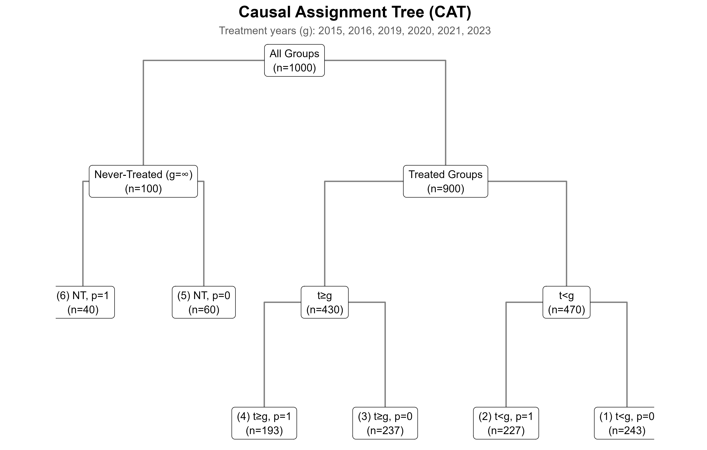
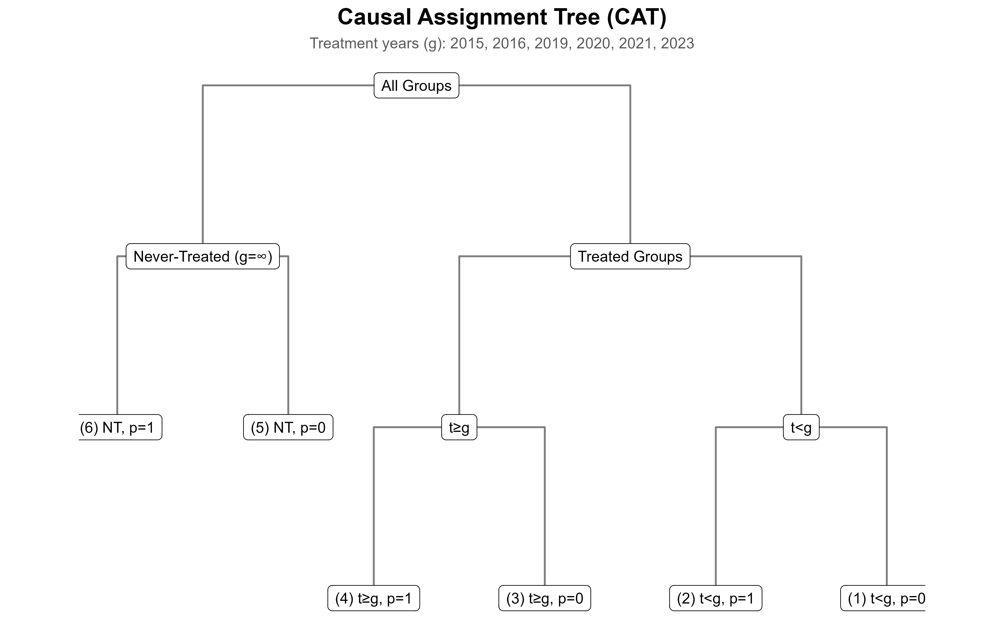

# catviz: Causal Assignment Tree Visualization for Staggered DiD, DDD, and Related Designs

**catviz** is an R package for visualizing and understanding **Causal Assignment Trees (CATs)** — hierarchical structures that summarize treatment timing, subgroup composition, and sample classification in **staggered difference-in-differences (CSDID) and staggered DDD like DRDDD** and related causal inference frameworks.

It provides a publication-ready visualization of treated, control, and never-treated groups, along with counts and subgroup summaries, to help researchers verify sample balance and treatment assignment logic.

---

## Working Example

The example creates simulated panel data for **hospitals nested within states**,  
where **states adopt treatment at different years**, and hospitals may also belong  
to binary subgroups (for DR-DDD analysis).

---

## Variable definitions

| Variable | Role | Description |
|-----------|------|-------------|
| `hospital_id` | **Unit ID** | Unique identifier for each hospital (unit of analysis). |
| `state` | **Group ID** | State identifier — treatment is assigned at this level. All hospitals in a state share the same treatment adoption year `g`. |
| `year` | **Time** | Calendar year (panel time dimension). |
| `g` | **First Treatment Year** | The first year the state adopts treatment (or `Inf` if never treated). |
| `p` | **Subgroup** | Binary subgroup indicator (e.g., `p = 0` vs. `p = 1`), used only for **DR-DDD**. Omit this variable for **CSDID**. |

---

## Example code

```r
# =======================================================
# Example: State-level staggered adoption with subgroups
# =======================================================

# Install if needed
# install.packages("devtools")
# devtools::install_github("VictorKilanko/catviz")

library(catviz)
library(dplyr)
library(tidyr)
library(purrr)  # for map()

set.seed(123)

# =======================================================
# 1. Define simulation setup
# =======================================================
states <- sprintf("S%02d", 1:20)    # 20 states
years  <- 2014:2023
N_hosp <- 5                         # 5 hospitals per state

# Assign first treatment year (g) per state
adopt_years <- c(2015, 2016, 2019, 2020, 2021, 2023, Inf)

state_level <- tibble(
  state = states,
  g = sample(adopt_years, length(states), replace = TRUE)
)

# =======================================================
# 2. Create hospitals nested within states
# =======================================================
hospitals <- state_level %>%
  mutate(
    hospital_id = map(state, ~ paste0(.x, "_H", 1:N_hosp))
  ) %>%
  unnest(hospital_id) %>%
  mutate(
    p = sample(0:1, n(), replace = TRUE)  # subgroup (omit for CSDID)
  )

# =======================================================
# 3. Expand to panel structure
# =======================================================
example_data <- expand_grid(
  hospital_id = hospitals$hospital_id,
  year = years
) %>%
  left_join(hospitals, by = "hospital_id") %>%
  arrange(hospital_id, year)

# =======================================================
# 4. Define CAT specification
# =======================================================
# Variables in the CSDID / DR-DDD framework:
# - id: unit of analysis (hospital_id)
# - group_id: grouping or treatment level (state)
# - time: time variable (year)
# - g: first treatment year for the group (state)
# - subgroup: subgroup classification (p), used for DR-DDD only

spec <- cat_spec(
  data      = example_data,
  id        = "hospital_id",
  time      = "year",
  g         = "g",
  subgroup  = "p",         # omit for pure CSDID
  group_id  = "state"      # treatment assigned at state level
)

# Label nodes for clarity
spec <- cat_label(spec)

# =======================================================
# 5. Summaries
# =======================================================
cat_counts(spec)   # counts per node (unit-level by default)

# =======================================================
# 6. Visualization
# =======================================================
dir.create("man/figures", recursive = TRUE, showWarnings = FALSE)

# Example 1: Default (unit-level counts)
out_units <- cat_plot_tree(
  spec,
  counts    = TRUE,
  count_by  = "units",   # counts unique hospitals
  save_plot  = "man/figures/CAT_plot_units.png",
  save_table = "man/figures/CAT_summary_units.csv"
)

# Example 2: Observation-level counts
out_obs <- cat_plot_tree(
  spec,
  counts    = TRUE,
  count_by  = "obs",     # counts hospital-year observations
  save_plot  = "man/figures/CAT_plot_obs.png",
  save_table = "man/figures/CAT_summary_obs.csv"
)

# Example 3: Hide counts (just structure)
out_nolabel <- cat_plot_tree(
  spec,
  counts    = FALSE,
  save_plot  = "man/figures/CAT_plot_nolabel.png"
)

# =======================================================
# 7. Display example plot
# =======================================================
print(out_units$plot)

# =======================================================
# 8. Confirm saved outputs
# =======================================================
message("Unit-level plot: man/figures/CAT_plot_units.png")
message("Observation-level plot: man/figures/CAT_plot_obs.png")
message("Summary tables saved in man/figures/")

```

## Example outputs

### 1. CAT plot (unit-level counts)

Below is the automatically generated **Causal Assignment Tree (CAT)** showing treated, control, and never-treated branches, with **counts based on unique units** (hospitals).


- **All Groups (n=100)**: Total number of unique hospitals  
- **Treated Groups (n=90)**: Hospitals in states that adopted treatment  
- **Never-Treated (g=∞, n=10)**: Hospitals in states that never adopted treatment  
- Branches such as `(3) t≥g, p=0` show subgroup and timing splits within treated groups

---

### 2. CAT plot (observation-level counts)

In this version, node counts reflect **total observations** (hospital-year combinations), not unique units.



This helps assess data coverage across pre- and post-treatment periods.

---

### 3. CAT structure only (no counts)

For schematic or publication purposes, you can hide counts entirely:



---

## 4. Treatment-year summary

The accompanying table summarizes the number of treated **units** by first treatment year and subgroup.

| g    | p_0 | p_1 | Total |
|------|----:|----:|------:|
| 2015 |  5 |  5 |   10 |
| 2016 |  9 |  6 |   15 |
| 2019 |  16 |  14 |   30 |
| 2020 |  4 |  1 |    5 |
| 2021 |  5 |  5 |   10 |
| 2023 |  9 |  11 |   20 |

📁 The table is also saved automatically as:
- `man/figures/CAT_summary_units.csv`
- `man/figures/CAT_summary_obs.csv`

---

## Interpreting the CAT visualization

The **Causal Assignment Tree** decomposes the dataset into mutually exclusive groups based on:
1. **Treatment timing (`g`)**  
2. **Pre/post period (`t < g` vs `t ≥ g`)**  
3. **Subgroup (`p`)**  

Each **node** in the tree represents a distinct subset of the data, and the associated count `(n)` corresponds to the number of unique hospitals (or observations, depending on the option selected).

### Reading the branches
- **All Groups**: The entire dataset of hospitals.  
- **Treated Groups**: States that eventually receive treatment.  
- **Never-Treated (g=∞)**: States that never receive treatment.  
- **t < g**: Pre-treatment observations (before adoption).  
- **t ≥ g**: Post-treatment observations (after adoption).  
- **p = 0 / 1**: Subgroup categories (for DR-DDD).

### Example interpretation
- 90 hospitals belong to treated states; 10 are never treated.  
- Among treated hospitals:
  - Those observed **before** their treatment year (t < g) appear under `(1)` and `(2)`.
  - Those observed **after** treatment (t ≥ g) appear under `(3)` and `(4)`.  
- The **subgroup split (`p=0`, `p=1`)** reveals balance across treated vs control subpopulations.

---

## 5. Why count type matters

By default, `cat_plot_tree()` counts **unique units (`count_by = "units"`)**, which is consistent with CSDID or DR-DDD analysis where the treatment effect is at the unit level.  
However, users can also choose **`count_by = "obs"`** to count total **unit-year observations**, which helps verify panel balance or data coverage.

| Option | Counts what | Use when |
|--------|--------------|----------|
| `count_by = "units"` | Unique entities (e.g. hospitals) | For effect estimation setup |
| `count_by = "obs"` | Total observations (e.g. hospital-year) | For panel completeness / sample checks |
| `counts = FALSE` | Hides counts entirely | For schematic figures or publications |

---

### Output verification
All outputs are saved in the `man/figures/` directory:
